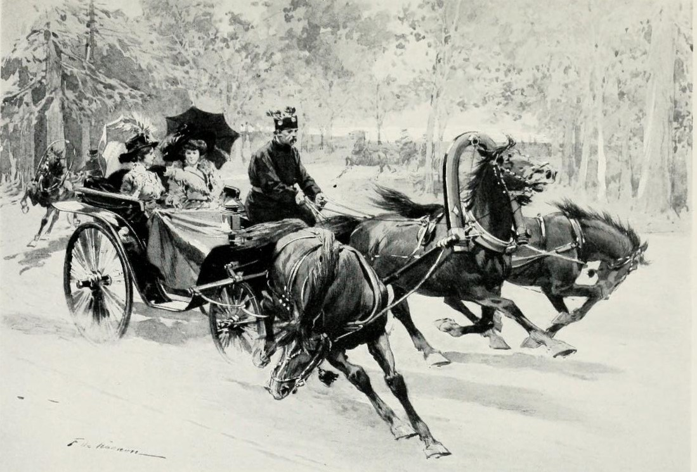

# Gradient Descent

<!-- Might still want to add visual demos & testing but this project has taken too long -->



## Outline

- [Gradient Descent](#gradient-descent)
  - [Outline](#outline)
  - [Motivation](#motivation)
  - [Math](#math)
  - [Variants](#variants)
    - [Batch Gradient Descent (full dataset)](#batch-gradient-descent-full-dataset)
    - [Stochastic Gradient Descent](#stochastic-gradient-descent)
    - [Mini-Batch Gradient Descent](#mini-batch-gradient-descent)
  - [Additional Techniques](#additional-techniques)
    - [Learning Rates](#learning-rates)
      - [1. Fixed](#1-fixed)
      - [2. Scheduled](#2-scheduled)
      - [3.Adaptive](#3adaptive)
        - [**Newton's Method**](#newtons-method)
        - [**Adagrad**](#adagrad)
        - [**RMSProp**](#rmsprop)
        - [**Adam**](#adam)
        - [**Nadam**](#nadam)
        - [**AMSGrad**](#amsgrad)
    - [Momentum](#momentum)
      - [Polyak Momentum](#polyak-momentum)
      - [Nesterov Acceleration](#nesterov-acceleration)
    - [Regularization](#regularization)
      - [L1 Regularization (Lasso)](#l1-regularization-lasso)
      - [L2 Regularization (Ridge)](#l2-regularization-ridge)
      - [Elastic Net Regularization](#elastic-net-regularization)
  - [Additional Hyperparameters/Techniques](#additional-hyperparameterstechniques)
  - [Convergence Criteria](#convergence-criteria)
  - [Stopping Conditions](#stopping-conditions)
  - [Limitations](#limitations)
  - [Installation \& Usage](#installation--usage)
    - [Prerequisites](#prerequisites)
    - [Environment Setup](#environment-setup)
  - [License](#license)

## Motivation

In Machine Learning, we often create functions for predicting labels on new data. Now, our main task here is the 'training' stage, i.e. finding the optimal parameters for our model. Of course, there are also the data collection & preparation, validation testing, and deployment stages, which in and of themselves are interesting, but they are not the topic for today.

Today, we will be discussing Gradient Descent. Imagine we are trying to optimize some [**loss**](https://github.com/intelligent-username/Loss-Functions) function for a given set of data. Now, this can be done deterministically in a 'perfect' way in cases where a trivial analytical solution exists (for example, in the cases of [**linear regression**](https://github.com/intelligent-username/Linear-Regression) or even [**simple polynomial**](https://github.com/intelligent-username/Polynomial-Regression) regression). However, this has a few issues.

Firstly, in polynomial regression, if we try to fit the graph with an extremely high degree polynomial, we will get near-perfect accuracy on the training data, but the produced model will collapse under slight deviations in new or unseen data. This is called overfitting. To prevent this, we use regularization techniques, which are more easily applied in the context of gradient descent.

Next, there may not *be* a straight-forward analytic solution. If the loss surface is high-dimensional and not convex, or if the loss surface isn't differentiable *everywhere*, there won't be a simple `.solve()` function that can find a solution. Gradient descent, which is inspired by Newton's method, can instead iteratively approximate a decent solution.

Finally, there is the most practical concern: computational efficiency. Even if an analytic solution exists, it may be computationally expensive to compute directly. Consider the case where we have 10 dimensions and 3 million data points. The matrices involved in a direct solution could be humungous. Gradient descent, by contrast, can work with mini-batches of data and update parameters incrementally, making it more scalable for large datasets.

In this writeup, we will implement gradient descent from scratch and demonstrate it on regression problems, showing how iterative refinement can replace direct solutions in high‑dimensional, nonlinear cases.

## Math

The math behind gradient descent is very simple. Suppose you have some loss function $L(\theta)$ that you want to minimize with model parameters $\theta$. The function $L$ will create some 'surface', and the point that we are on on that surface is determined by our current 'coordinates' $\theta$. Our goal is to find the global (or at least local) minima of this surface.

The gradient descent algorithm works as follows:

$$
w_{i+1} = w_i - \eta \nabla L(w_i)
$$

Where:

- $w_{i+1}$ are the updated model parameters after iteration $i$.
- $w_i$ are the model parameters at iteration $i$ (e.g., weights in linear regression).
- $\eta$ is the *learning rate*, a small positive scalar that controls the step size. Note, in Newton's method, this is actually the inverse of the Hessian in place of the constant $\eta$, which is more accurate but way more costly.
- $\nabla L(w_i)$ is the gradient of the loss function at $w_i$, indicating the direction of steepest ascent (by the Cauchy-Schwarz Theorem).
- Subtracting the gradient moves us towards the minimum.

This is iterative minimization. We continue doing this until we're satisfied with the accuracy of the model. Specifically, we may check if the change in loss, $\Delta L$ between iterations is smaller than some predefined threshold or until we run out of iterations. More formally, it is written with the condition:

$$
|L(w_{i+1}) - L(w_i)| < \delta
\\
\lor
\\
||\nabla L(w_{i+1})|| < \epsilon
\\
\lor
\\
i >= N
$$
  
(Where $N$ is the maximum number of iterations, and $\epsilon$ and $\delta$ are small positive thresholds. Other conditions will be discussed [later](#stopping-conditions)).

Thus, when changing these parameters around, the values of the initial hyperparameters and the methods used are the only things that are really tunable. The pause conditions are important but become less and less significant as they shrink to zero. It is important to intelligently pick a learning rate: too small and the model will be slow (and simply never get close enough to the minimum), too large and the model will diverge (overshoot the minimum and oscillate out of control). Later in this writeup, we will discuss the different methods for customizing all of these components.

Note that, usually, it is not enough to simply perform gradient descent. We will likely need separate training, validation, and testing sets. Also, we will have to pass through the data multiple times (epochs) to get a good fit. Finally, we will often times have to regularize the model to prevent overfitting.

## Variants

Now that we understand gradient descent algorithm abstractly, we need to implement it specifically. There are three components that we need:

1) A [loss function](https://github.com/intelligent-username/Loss-Functions) $L(\theta)$ to minimize
2) A way to **compute** the gradient(s) $\nabla L(\theta)$, and
3) A strategy for updating the parameters (i.e., the learning rate $\eta$)

Today's topic will be the third components, as this is gradient descent-specific.

### Batch Gradient Descent (full dataset)

This is the most 'vanilla' form of gradient descent. In this method, we have *some* loss function whose gradient changes depending on the parameters, $\theta$ that are passed into it.

We start off the gradient descent by choosing the initial parameters, $w_0$, either randomly or heuristically. For convex problems, initial parameters parameters can start anywhere because the Loss will converge anyway, but otherwise, they should be chosen carefully.

Then, we compute the gradient of the loss function at these parameters, $\nabla L(w_0)$:

$$
\nabla L(w_0) = \frac{1}{N} \sum_{i=1}^{N} \nabla_w l(f(x_i; w_0), y_i)
$$

Where:

- $m$ is the number of training examples
- $l$ is the individual loss function
- $f(x_i; w_0)$ is the model's prediction for input $x_i$ with parameters $w_0$
- and $y_i$ is the true label for input $x_i$.

We substitute the values of the initial parameters (a.k.a. the current point) into the gradient function to find the direction of greatest ascent.

Finally, we take a step in the opposite direction of the gradient, scaled by the learning rate.

We repeat this process with the newly attained parameter until one of the [stopping conditions](#stopping-conditions) is met.

Since Batch Gradient Descent computes the entire dataset through the gradient, it is very stable (a single update uses an entire epoch). However, it is also relatively slow. Oftentimes, it's even slower than finding the analytic solution (if it exists).

### Stochastic Gradient Descent

Stochastic Gradient Descent is identical to Batch Gradient Descent mathematically, but, instead of computing the gradient over the entire dataset, which takes a total of $O(m)$ per update, we compute it over a single data point (randomly selected (hence the *stochasticity*) without replacement). This dramatically reduces the computation time to $O(1)$.
The model converges a lot more quickly in terms of raw time, but takes more iterations to do so. Because we need more iterations, the batch count will also increase. Also, since we are sampling randomly, we will likely have a lot of noise, which makes the fit the final model weaker. This is actually a good thing, since it curbs overfitting. However, the noise can also make convergence more erratic, and it may oscillate around the minimum rather than settling down.

### Mini-Batch Gradient Descent

Mini-batch Gradient Descent is a compromise between Batch and Stochastic Gradient Descent. Instead of using the entire dataset or a single data point, we use a small, randomly selected subset of the data (a **mini-batch**) to compute the gradient. This allows us to take advantage of the stability of Batch Gradient Descent while still benefiting from the speed and robustness of Stochastic Gradient Descent.

Mini-batch gradient descent introduces a new hyperparameter which can be tuned: the batch size. Call this batch size $s$, with $1 < s < m$.
Each update will take $O(s)$ time, and create $O(m/s)$ updates per epoch. This is often the best balance between accuracy, speed, and generalization.

## Additional Techniques

The above variations use the same update rule but change how the loss's gradient is calculated by changing the batch size. The following techniques change the update rule itself. They can be used in tandem with any of the above batch size strategies to create beautiful, hybrid algorithms.

---

### Learning Rates

The learning rate, $\eta$, controls how big of a step we take in the direction of the negative gradient during each update. There are three main types of learning rates.

#### 1. Fixed

The simplest option is to set $\eta$ to some empirically-derived constant that seems to generally work well. However, this is not always optimal, as there is no real way to find an optimized universal learning rate. If the learning rate happens to be too high, the model will never converge, and, if it's too low, it will take too long. Often, experimenting with learning rates takes so much trial-and-error that it's not worth the effort.

#### 2. Scheduled

Scheduled learning rates start with some initial learning rate $\eta_0$ and then decay it over time according to some schedule. Common schedules include:

- **Step Decay**: Reduce the learning rate by $\gamma \in (0,1)$ every $k$ epochs.
  
$$
\eta_k = \eta_0 \cdot \gamma^{\lfloor t / k \rfloor}
$$

The constant $t$ sets the decay time scale.

- **Exponential Decay**: Decay the learning rate exponentially.

$$
\eta_k = \eta_0 \cdot \gamma^{-\lambda k}
$$

With $\lambda$ controlling the rate of decay.

- **Inverse Time Decay**: Decay the learning rate inversely proportionally to the epoch number.

$$
\eta_k = \frac{\eta_0}{1 + \gamma k}
$$

Scheduled rates/formulas also require empirical tuning for $\gamma$ and $\lambda$, but they are more consistent and convergent as loss functions tend to flatten out near a minimum anyway.

#### 3.Adaptive

These are the real optimizations. Adaptive learning rates adjust not just the learning rate but the learning method based on the current behaviour of the loss function's gradient. This means that, with a 'strange' enough loss surface, the learning rate can go down, then back up, etc. and continue oscillating until convergence is reached. Note that the notation I use isn't very 'canonical', as it is designed to make the math behind the implementation clearer. It is still correct.

##### **Newton's Method**

Based on Newton's root-finding technique, this method uses the second-order derivative (Hessian) to find the optimal learning rate, and substitutes it as the updated learning rate for the canonical gradient descent update. It can converge faster than first-order methods but is computationally expensive. It is written as:

$$
w_{i+1} = w_i - H^{-1} \nabla f(x_i)
$$

If we want to dampen the effects of the Hessian, we can add a decay term, $\lambda$, that, for example, updates after every batch:

$$
w_{i+1} = w_i - (H+\lambda_k I)^{-1} \nabla f(x_i)
$$

Although this method is highly accurate and mathematically elegant, it is often avoided due to the sheer cost of calculating, inverting, and transposing  Hessians.

##### **Adagrad**

In some cases, different parameters need to be adjusted at different rates. For example, in natural language processing, some words are more common than others. We want to adjust the learning rate for each parameter based on how frequently it is updated.

In Adagrad, the learning rate is adjusted in proportion with the momentum of the gradient of the loss function. The general formula is:

$$
\eta_{t+1} = \frac{\eta_0}{\sqrt{G_{t}} + \epsilon}
$$

Where

- The new learning rate is $\eta_{t+1}$.
- $\eta_0$ is constant: the initial learning rate.
- $G_{ii}$ is the sum of the squares of the gradients w.r.t. parameter $i$ up to the iteration at time $t$, written as $G_{t} = \sum_{j=1}^{t} \nabla_{w_i} L(w_j)^2$.
- $\epsilon$ is a constant to prevent division by zero (or reduce the impact of gradients).
- $\eta_0$ is the initial learning rate.

The only problem with Adagrad is that it decreases monotonically, which can lead to the gradient shrinking too quickly and staying small permanently, thereby preventing further learning.

##### **RMSProp**

RMSProp fixes the shortcomings of Adagrad by using the exponentially weighted moving average, $E\left[g^2\right]$, of the squared gradients instead of the generic sum of squares.

The formula is:

$$
\eta_{t+1} = \frac{\eta_0}{\sqrt{v_t} + \epsilon}
$$

Where:

- $v_t = \beta_2 v_{t-1} + (1 - \beta_2) g_t^2$, the exponentially weighted moving average of the squared gradients at iteration $t$. Note that $v_0 = 0$.
- $g_t = \nabla_w L(w_t)$ is the gradient of the loss function with respect to the parameters $w$ at iteration $t$.
- $\beta_2 \in [0,1)$ is the decay rate controlling how much history is retained; larger $\beta_2$ gives smoother averages.
- $1 - \beta_2$ is the weighting applied to the current squared gradient $g_t^2$.
- $\eta_0$ is the initial learning rate (scalar hyperparameter set by the user).
- $\epsilon$ is a small constant added to the denominator to prevent division by zero or extremely small step sizes.
- $\eta_{t+1}$ is the effective per-parameter learning rate applied at iteration $t+1$.

##### **Adam**

Adam's method is the culmination of all of these adjustment methods. It creates parameter-specific learning rates that are adapted based on the first and second moments of the gradients. It then makes use of our next technique, momentum, to smooth out the updates.

$$
\eta_{t+1} = (\eta_0)
\cdot
\frac
{\hat{m}_{t,i}}
{\sqrt{\hat{v}_t} + \epsilon}
$$

Here, $m$ is the 'momentum' and $v$ is the 'velocity'. We multiply by the 'momentum' to move in the general direction of the change in gradients. Then, we divide by the 'velocity' in order to normalize the step size, scaling updates down for parameters with consistently large gradients and up for sparse or small-gradient parameters.

Velocity is also known as the second moment (the uncentered variance), and momentum is also known as the first moment (the mean).

Where:

$$
m_{t,i} = \beta_1 m_{(t-1),i} + (1 - \beta_1)g_{t,i}
$$

With $\beta_1$ controlling how much 'history' of momentum we retain.

$$
v_{t,i} = \beta_2 v_{(t-1),i} + (1 - \beta_2)g_{t,i}^2
$$

With $\beta_2$ controlling how much 'history' of velocity we retain. The greater $\beta_2$ is, the 'smoother' the adjustments, as recent gradients become less significant. Note that this is the same technique as used in RMSProp.

$$
g_t = \nabla f(x_{t-1})
$$

Note that both $m_t$ and $v_t$ are initialized to zero vectors.

Sometimes, if we want to be extra efficient, we adjust the bias of the $m_t$ and $v_t$, as their initialization at zero skews them downwards, making them inefficient early on. In this case, everywhere we see the variables $m_t$ and $v_t$, we replace them with $\hat{m}_t$ and $\hat{v}_t$, respectively, with:

$$
\hat{m_t} = \frac{m_t}{1 - \beta_1^t}
$$

and

$$
\hat{v_t} = \frac{v_t}{1 - \beta_2^t}
$$

\*Note that this bias correction becomes negligible as $t$ increases. This is only a small optimization and is mostly only visible in the first few iterations, so it may be neglected for the sake of saving compute time.

Also, we may occasionally reset our two moments to zero. For example, if the parameters start to oscillate or get stuck, or if the learning rate changes too drastically.

##### **Nadam**

Nadam combines Adam with Nesterov momentum, modifying the first-moment term to include a lookahead of the gradient. The update rule is:

$$
w_{t+1} = w_t - \eta_0 \frac{\hat{m}_t^{\text{Nesterov}}}{\sqrt{\hat{v}_t} + \epsilon}
$$

Where:

- $\hat{m}_{t}^{\text{Nesterov}} = \frac{\beta_{1}\hat{m}_{t-1} + (1 - \beta_{1}) g_{t}}{1 - \beta_{1}^{t}}$.
- $\hat{v}_{t} = \frac{v_t}{1 - \beta_{2}^t}$ is the bias-corrected second moment, with $v_{t} = \beta_{2} v_{t-1} + (1 - \beta_{2}) g_{t}^{2}$.
- $g_{t} = \nabla_{w} L(w_{t})$ is the gradient of the loss function w.r.t. parameters at iteration $t$.
- $m_{t-1}$ is the previous first-moment vector (momentum) initialized to zero at $t=0$.
- $v_{t-1}$ is the previous second-moment vector (uncentered variance) initialized to zero at $t=0$.
- $\beta_1 \in [0,1)$ is the decay rate controlling how much past momentum is retained.
- $\beta_2 \in [0,1)$ is the decay rate controlling how much past squared gradients are retained.
- $1 - \beta_1$ weights the current gradient contribution to momentum.
- $1 - \beta_2$ weights the current squared gradient contribution to velocity.
- $\eta_0$ is the initial learning rate.
- $\epsilon$ is a small constant to prevent division by zero.
- $w_{t+1}$ is the updated parameter vector applied at iteration $t+1$.

##### **AMSGrad**

AMSGrad is a variant of Adam designed to improve convergence by preventing the adaptive learning rates from increasing. It modifies the second-moment term:

$$
w_{t+1} = w_t - \eta_0 \frac{\hat{m}_t}{\sqrt{\hat{v}_t^{\text{max}}} + \epsilon}
$$

Where:

- $\hat{m}_t = \frac{m_t}{1 - \beta_{1}^t}$ is the first moment
- $m_t = \beta_1 m_{t-1} + (1 - \beta_1) g_t$ is the bias correction.
- $v_t = \beta_2 v_{t-1} + (1 - \beta_2) g_t^2$ is the uncorrected second moment (same as Adam).
- $\hat{v}_t^{\max} = \max(\hat{v}_{t-1}^{\max}, \hat{v}_t)$ ensures the denominator never decreases.
- $g_t = \nabla_w L(w_t)$ is the gradient at iteration $t$.
- $m_{t-1}$ and $v_{t-1}$ are previous first and second moments, initialized to zero at $t=0$.
- $\beta_1, \beta_2 \in [0,1)$ are decay rates for first and second moments.
- $1 - \beta_1$ and $1 - \beta_2$ weight the contributions of the current gradient and squared gradient.
- $\eta_0$ is the initial learning rate.
- $\epsilon$ prevents division by zero.
- $w_{t+1}$ is the updated parameter vector at iteration $t+1$.

---

### Momentum

Momentum updates the gradient algorithm by using the trajectory from previous steps. They only incorporate the momentum of the gradients, rather than the gradients themselves. The two main types of momentum are as follows.

#### Polyak Momentum

This is the classical momentum method.

$$
w_{t+1} = w_{t} - \eta v_t
$$

Where $v_t = \beta v_{t-1} + (1-\beta) g_t \ \ \ \text{and} \quad g_t = \nabla_w L(w_t)$

#### Nesterov Acceleration

Like classical momentum, except the velocity is updated with lookahead.

$$
w_{t+1} = w_t - \eta v_t
$$

With $v_t = \beta v_{t-1} + (1-\beta) \nabla_w L(w_t - \eta \beta v_{t-1})$

---

### Regularization

The biggest problem with gradient descent is that it's *too accurate* on the training data. As a result, it doesn't generalize well to new inputs. This happens because the models grow so complex that they exactly pass as closely through as many points as possible, including the noise.

As a reminder, when we perform gradient descent, we do so on the loss function, which is our tool for measuring the difference between our predicted values and the actual values, i.e. accuracy. Different loss functions are applied in different contexts. When we find the absolute minimum of the loss function, we create something that is as close to the training data as possible, which may be of no use, given that our samples are unlikely to be perfectly representative of the population.

This is called overfitting. Regularization techniques add a penalty to the loss for function complexity (like large weights or high-degree polynomials).

For each type of regularization below, we will use a generic $L$ to refer to an un-regularized loss function, and $L'$ to refer to it's regularized version. Once again, keep in mind that $w$ denotes the weights and $\lambda$ being a constant that controls the *strength* of the given regularization. Thus, when performing gradient descent on a set of parameters $w$ with the set of data points $X$, we will instead differentiate and optimize $L'$.

Although this topic would require a whole writeup [of its own](https://github.com/intelligent-username/Regularization), it's important to at least understand how the loss functions can be optimized and integrate the most relevant versions into this project.

#### L1 Regularization (Lasso)

$$
L'(w) = L(w) + \lambda \sum_{j=1}^{N}(|w_j|)
$$

In L1 Regularization, we modify the loss function by adding the values of the parameters as arguments. They now contribute to the loss. Since we are minimizing loss, the gradient descent will be encouraged to find a good balance between the data fit and model complexity.

Some weights even go to or near zero, which gives us free feature selection and simplifies the final deployment model.

Note that, when differentiating the absolute value function, call it $f$, we have:

$$
\frac{\partial{f}}{\partial{w_j}} =
\begin{cases}
-1 &&& \text{if } w_j < 0,
\\
1 &&& \text{if } w_j > 0,
\\
\text{any value} \in [-1, 1], \text{typically 0} &&& \text{otherwise} \\
\end{cases}
$$

#### L2 Regularization (Ridge)

$$
L'(w) = L(w) + \lambda \sum_{j=1}^{N}{w_j^2}
$$

The penalty of L2 Regularization is the sum of the squares of the parameters. Once again, this encourages smaller weights, and pushes the model to predict the mean rather than the median, which is more robust to outliers.

Since the terms are squared, large terms grow quadratically, thus being the primary target when minimizing the loss. If all weights in the model are $<=1$, this may cause issues, as the contribution from each term will be even smaller when squared.

#### Elastic Net Regularization

$$
L'(w) = L(w) + \lambda \sum_{i=1}^{N}{|w_i|} + (1 - \lambda) \sum_{j=0}^{N}{w_i}^2
$$

Elastic regularization is literally the L1 and L2 regularization combined. It adds both the squares and the absolute values of the weights to the loss function. It performs both feature selection and weight decay.

With $\lambda \in [0, 1]$.

We may also want to have two *separate* scalars, not necessarily within $[0,1]$ to make the regularization more extreme.

## Additional Hyperparameters/Techniques

These are very helpful but underrated.

- Patience: a term for seeing how many consecutive times the loss fails to improve before stopping early.
- Initial learning rate
- Rounding (T/F): Taking the ceiling or floor right before returning the final weights

Whether or not to use these depends on the problem.

## Convergence Criteria

Convergence occurs when the infimum or minimum  of the Loss function is very closely approached:

$$
\lim_{t \to \infty} |L_{t} - L_{t-1}| = 0
$$

Or, more clearly:

$$
\forall \epsilon, \ \exists \delta, \zeta \ \ s.t. \ ||w_{t} - w_{t-1}|| < \delta \implies ||\nabla{L(W)_t}|| < \epsilon \ \lor \ |L(w_{t}) - L(w_{t-1})| < \zeta
$$

## Stopping Conditions

We want to stop when the model has converged. This can be expressed in a similar way to the criteria above, with hyperparameters $\delta$, $\epsilon$, and $\zeta$. When running the algorithm, we can check if any of the following conditions are met::

$$
\begin{aligned}
&||\nabla_w L(w_t)|| < \epsilon  &&\text{(gradient near zero)} \\
&|(Lw_t) - L(w_{t-1})| < \zeta  &&\text{(loss no longer improving)} \\
&||w_t - w_{t-1}|| < \delta  &&\text{(weights no longer changing)} \\
&t \ge N &&\text{(max iterations reached)} \\
&k \ge M &&\text{(max epochs reached)} \\
&L_{\text{val}}(t) > L_{\text{val}}(t-1) && \ \text{(validation loss rising → early stop)}
\end{aligned}
$$

Where $N$, is the maximum number of iterations, $M$ is the maximum number of epochs, and $\epsilon$, $\zeta$, and $\delta$ are small positive thresholds.

We may use any combination of these conditions. The first three ensure convergence, while the last three prevent infinite loops and overfitting.

## Limitations

- The effectiveness of gradient descent depends on hyperparameters, even with automatic tuning.
- Difficult to maintain numerical stability with high-dimensional data.
- The parameters may get stuck in local minima around the loss surface.

## Installation & Usage

### Prerequisites

- C++ compiler (g++, clang++, or MSVC)
- CMake (version 3.10 or higher)
- IDE or text editor of your choice (e.g., VSCode)

### Environment Setup

1. Clone the project:

    ```bash
    git clone https://github.com/intelligent-username/Gradient-Descent
    cd Gradient-Descent
    ```

2. Create a build directory and enter it:

    ```bash
    mkdir build
    cd build
    ```

3. Run CMake to configure the project:

    ```bash
    cmake ..
    ```

4. Compile the project:

    ```bash
    make        # Linux/WSL/MinGW
    ```

    or

    ```bash
    cmake --build .  # cross-platform
    ```

5. Run the executable:

    ```bash
    ./second # Or .\second.exe on Windows
    # Any other files compiled with CMake will end up in this folder and can be run similarly.
    ```

Any other file that is modified or created, use the gradient descent algorithm, and be compiled and ran with the same steps. You may want to add to CMakeLists.txt, but that is unlikely unless you're changing the gradient descent implementation.

Side notes:

- Eigen is the math library, included in `include/`, without it, the operations would need to be implemented by hand and likely be less efficient anyway.
- All source code is in `src/`, headers in `include/`.
  
## License

Eigen is distributed under the [MPL2 License](https://eigen.tuxfamily.org/dox/GettingStarted.html#GettingStarted_License), datasets are from Kaggle (open source). This repository is distributed under the [MIT License](LICENSE). Feel free to fork (and star😇)
